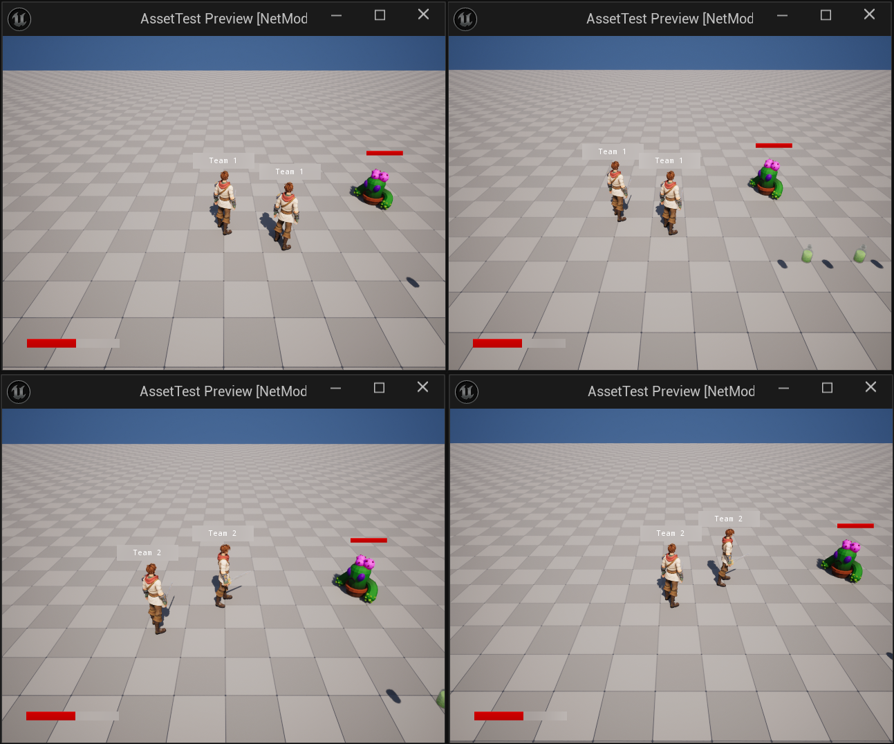

# ue_personal_demo_project

这是一份 UE5 个人示例，包含的大多数内容记录在博客。

自定义CharacterMovementComponent: <https://szxcboo.github.io/posts/CharacterMovementComponent/>

自定义 ReplicationGraph: <https://szxcboo.github.io/posts/ReplicationGraph/>

FastArray 背包系统: <https://szxcboo.github.io/posts/FastArrayInventory/>
